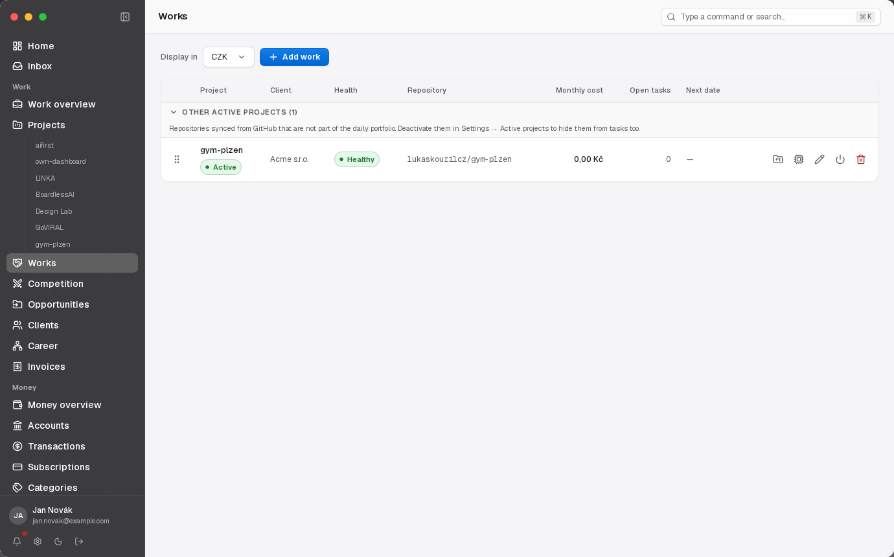
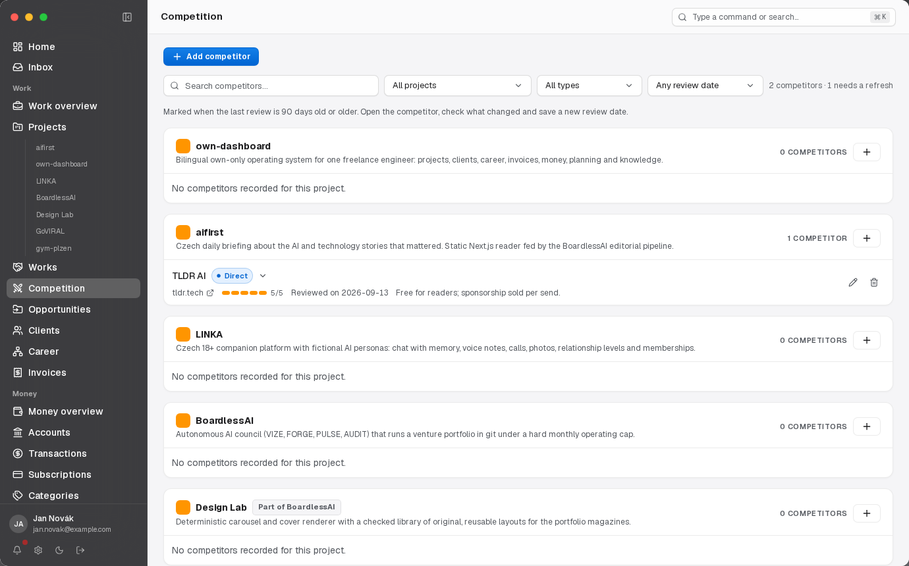
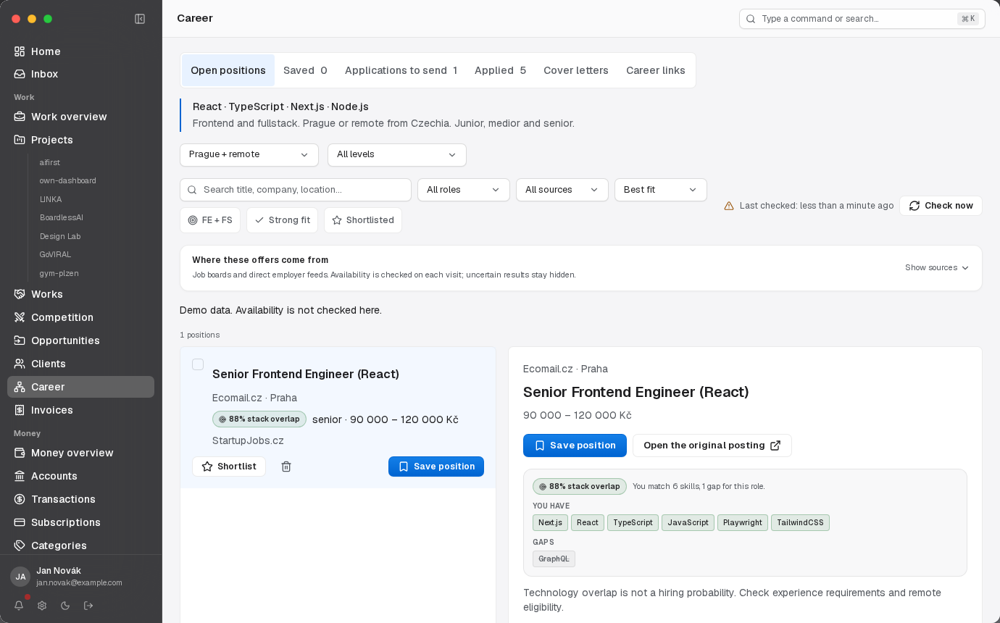

# Changelog

What shipped in OwnDashboard, newest first, one dated entry per release.

`src/lib/changelog.ts` is the source of truth for these entries and this file is
generated from it, so edit the module and regenerate — `tests/lib/changelog.test.ts`
fails when the two disagree. Publish a new entry at least every two weeks, with one
authentic `/dev-preview` capture per feature (see `media/changelog/README.md`).
A feature without a capture yet carries no image at all; never stand in a
placeholder or generated screenshot.

## 2026-09-17 — Transaction rules, payment matching, weekly planning and a career board

### Shipped

- **Staged transaction rules** — The single-keyword auto-category is replaced by a rule list: conditions over description, account, amount, date and direction, ten operators, three stages and least-specific-first ranking inside a stage, with actions that write category, project, subscription or description. The editor shows how many transactions a rule matches before anything is applied, and the same engine files rows from bank sync, CSV import and a retroactive apply. The old table stays as the rollback path.

- **Invoice payment matching** — Incoming payments are paired with issued invoices on variable symbol and amount, inside the invoice's own rounding tolerance and with no model involved. Every leftover carries a reason and can be linked by hand, and the variable symbol is captured at ingest from both the bank feed and CSV. Whether a Czech bank sends that symbol as a structured field or only inside the message text is not yet known from a real account.

- **Company registers behind the client form** — An IČO fills a client's legal name and address from the Czech economic-subject register, and a DIČ can be checked against VIES. The verdict is cached against the exact number it was obtained for, so editing the VAT id invalidates it instead of carrying an answer for a different one, and a member state that does not answer is recorded as unavailable rather than as a negative. The invoice buyer block shows the stored verdict and flags a registered name that differs from the one on the invoice. Neither service needs credentials.

- **One interface in front of bank sync** — `bank_connections` was shaped around GoCardless and did not model the ninety-day PSD2 consent lapse at all, so a lapse only surfaced when a sync happened to run. A provider interface and a single registry now sit in front of three adapters: GoCardless, whose behaviour is unchanged, Fio with a per-user read-only token, and Enable Banking. A Fio token is one person's bank credential, so it is stored service-role-only with no policy at all and never appears in a response body. Only the GoCardless path has ever run against a live account: Fio's HTTP path is untested and Enable Banking raises a typed unavailable error instead of pretending to connect.

- **Cron heartbeats** — A cron that stops firing reports nothing, because nothing runs. A successful run now pings an outbound push monitor and stamps its own `last_success_at`, so freshness shows beside each cron's cost with no external service involved. A cron with no heartbeat URL is unmonitored and says so rather than implying a health it cannot know. The alerting half needs a push monitor hosted somewhere; this app does not host one, so nothing alerts yet.

- **A guided weekly planning flow** — The weekly review's six textareas became five steps: last week's calendar time split into client, own-project and admin work, the daily-focus tasks actually finished, what carries forward, next week's objectives, and a summary that still holds the legacy free-text lists. The split is a whole-word, diacritic-insensitive match on organization and project names, and the number of events that named neither is always on screen. Only aggregates are stored — no event title, location or attendee. With Google Calendar disconnected the step says so and offers the relink button instead of a fabricated split.

- **A career pipeline board with contacts** — Applications have a stage board beside the list, a contact name and address per application, and follow-up dates. The recruiter or hiring manager used to live in the free-text notes, which meant it could not be shown on a card or exported as a column; it now uses the same pair `client_opportunities` already models. The email check is format validation — nothing in an application ever contacts an address.

- **Competitor review freshness** — A competitor reviewed more than ninety days ago, or never reviewed, is labelled rather than silently trusted. The review date sits in the always-visible metadata and a filter narrows the list to what needs a refresh.

- **Confirmed subscription amounts** — Development finance separates a figure read from an invoice from one inferred from a renewal notice. `amount_confirmed_on` records the check, the editor clears it the moment the amount, currency or cycle changes, and Money prints how much of the recurring total still rests on an unconfirmed figure.

### Fixes

- A weekly review opened between midnight and the UTC offset hour on a Monday keyed to the previous Sunday, because `mondayKey` built a local Monday and then read the UTC date off it. It now formats in local time like `todayKey`; a row written in that window keeps its Sunday date and is still exported.
- The Links library can merge one category into another, and category names that collapse to the same key are flagged as likely duplicates.
- Subscription vendor notes recorded during the import are readable in the app.
- The payment-matching cron is registered daily rather than hourly, because the recorded Vercel plan cannot fire more often. The matcher is idempotent, so a paid plan changes the schedule string and nothing else.

## 2026-09-16 — Works, Competition and development finance

### Shipped

- **Portfolio registry and Works** — The daily projects are materialized from a code-level registry, so a repository shows up in Projects even when the GitHub allow-list predates it. Projects carry a scope, a parent and a portfolio key, and client repositories open as Works with the same workspace.

  

- **Competition** — Each project keeps its competitors with a score, useful features, social content, pricing model and the lessons taken from them, editable in a dialog and reachable from a project workspace tab.

  

- **Development finance in the Money overview** — Money reports recurring commitments, paid invoices, the unallocated remainder and a twelve-month timeline. A subscription is split across projects by share and a paid invoice inherits that split, so nothing has to be guessed.

  

- **Reviewed Ideas and pricing-filtered link exports** — The resource library gained reviewed Ideas, a tighter link taxonomy and exports that can be filtered by pricing model.

### Fixes

- Inactive subscription rows on Home use muted text instead of reduced opacity, which the mobile accessibility scan had flagged for contrast.
- Quarterly billing joined the supported subscription cycles.
- Ideas reconcile against the current resource library instead of the original seed list.

## 2026-09-11 — Resource library, freelance profiles and Drive-backed applications

### Shipped

- **Searchable resource library** — Links are browsable as expandable cards with search, so a saved resource can be found without scrolling the whole list.

- **Freelance profiles and proposal tracking** — Opportunities gained an own-only platform directory with editable profile and service drafts, proposal text, document links and a platform-filtered response rate. A draft never implies a published external account or a sent proposal.

- **Prepared applications connected to Drive** — Career links each prepared position to its posting and its Google Drive letter, records a sent snapshot atomically, keeps progress history and reports first replies, follow-up dates and cohort response statistics.

## 2026-09-07 — Career rebuilt around job matching

### Shipped

- **Match scoring and tailored letters** — Career was redesigned around an explicit, comparable match score per listing and application letters written for the specific position, with selected leads and letter guidance alongside them.

  

- **A saved stage before applying** — A position can be saved before it becomes an application, so the pipeline separates interest from a letter that was actually sent.

### Fixes

- Live job pages are given longer to respond before a listing is treated as gone.
